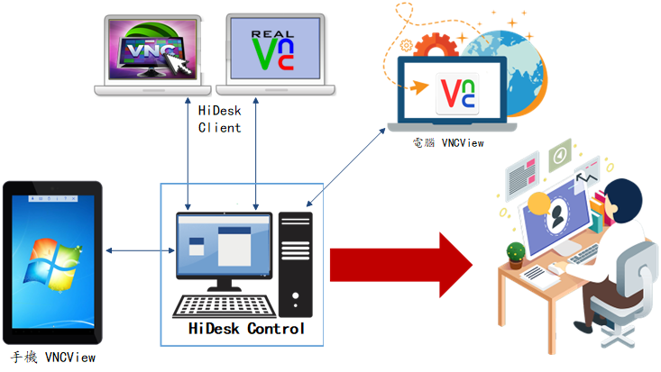
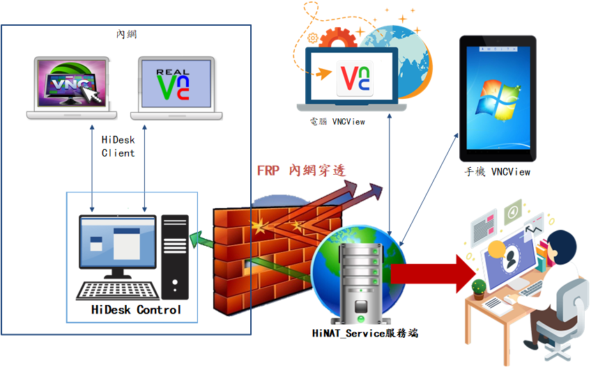

# HiDesk - 小企業專用，快速遙控遠端電腦桌面
HiDesk是 IsoFace 提供的免費軟體，安裝在 Windows 作業系統的電腦，就能透過網路，使用某台電腦去遙控遠端另一部電腦的操作。例如利用遠端遙控即可從辦公室的電腦連線至遠端客戶的電腦，檢閱使用者電腦的設定與環境，以較快的速度解決各種電腦使用上的問題。

> **加入 Facebook 社團**
>
> [https://www.facebook.com/groups/isoface/](https://www.facebook.com/groups/isoface/)
> 
> **點讚追蹤 Facebook 粉絲專頁**
> 
> [https://www.facebook.com/AIOT.ERP](https://www.facebook.com/AIOT.ERP)

HiDesk 需要事先部署到電腦中，協助您連接遠地的電腦桌面。並使用連接密碼，確保安全性。HiDesk 支持多語言模式，連接的電腦可利用 Flying 進行網路印表工作。它包括用戶端、控制端並可搭配內網穿透工具 HiNAT，使用遠端控制和內網穿透服務解決方案。它使用 frp 內網穿透，通過 VNC遠端控制技術提供快速流暢的遠端控制服務。所使用的內網穿透工具，通過圖形化介面設置，提供高性能、高效的反向代理功能。

特色：
1. 搭配 HiNAT 內網穿透服務程式，使用者可自行部署運行測試，無需公有雲服務。
2. 運用 HiNAT 的 FRP 內網穿透與 VNC 遠端控制，使用成熟的解決方案，遠端控制頻寬消耗低，網路延遲低，具有更好的遠端控制效果。
3. 提供圖形化介面的內網穿透配置方式，避免設定檔編寫導致的內網穿透服務運行錯誤，直觀簡單。
4. 提供 Web 控制介面，設置通訊埠轉發、內網穿透、反向代理服務狀態，並進行監控與管理。
5. 將手機變成遠程桌面，從任何地方即時訪問 Windows 電腦。遠程查看電腦桌面，就像坐在電腦前面一樣，控制滑鼠和鍵盤。

以往管理電腦都是到電腦前操作，但是當企業的業務型態日複雜，維護人員管理電腦的難度就越高，這時就希望能有統一的中央遙控工具，幫助管理者能在同一地方，操作所有電腦...。HiDesk 是程式精實的遠端遙控程式，協助小企業以最低的維護成本，進行快速遙控服務。

HiDesk 使用 HiNAT 的 frp 內網穿透方案，進行遠端遙控服務，HiDesk 安裝簡單、使用便捷。它是高性能的反向代理應用，支援多種通訊協定，可以遠端連接局域網設備，例如進行遠端桌面、SSH等應用場景。自行搭建 HiNAT 的 frp 內網穿透，沒有使用量或速度限制的，完全取決於電腦速度和網
路流量，只要電腦網路流量夠多並且速度快，就可以完全發揮功能。

運用場景：
1. 客戶即時遠端協助技術支援。
2. 內網部署服務提供公網訪問。
3. 部署服務，實現埠轉發。
4. 網站服務的反向代理，支援 SSL 協定流量的轉發。
5. 物聯網設備的遠端存取

* **HiDesk 手冊**：https://isoface.net/isoface/doc/hidesk/main/